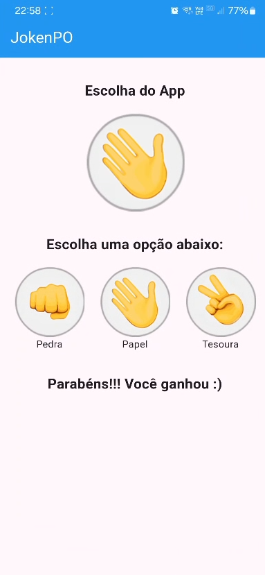

# JokenPo App

## 📌 Descrição

Este é um aplicativo do jogo **JokenPô (Pedra, Papel e Tesoura)** desenvolvido para fins acadêmicos. O App permite que o usuário jogue contra um "bot" do aplicativo, escolhendo uma das três opções e vendo o resultado da rodada.

## 🎯 Funcionalidades

- 🎮 **Interface intuitiva**
- ✋ **Possibilidade de escolha entre Pedra, Papel ou Tesoura**
- 🤖 **Geração automática da escolha do oponente**
- 🏆 **Exibição do resultado da partida**

## 🛠️ Tecnologias Utilizadas

- **Linguagem de programação:** Dart
- **Frameworks e bibliotecas:** Flutter, Material Design
- **IDE utilizada:** FlutLab.io

## 📸 Capturas de Tela




## 🎬 Demonstração do App


## 📂 Estrutura do Projeto

```bash
JokenPo/
├── images/
├── lib/
│   ├── jogo.dart
│   ├── main.dart
├── README.md
```

## 📌 Contribuição

Caso queira contribuir para melhorias no projeto, sinta-se à vontade para fazer um **fork** e abrir um **pull request**.

## 📄 Licença

Este projeto foi desenvolvido para fins acadêmicos.
